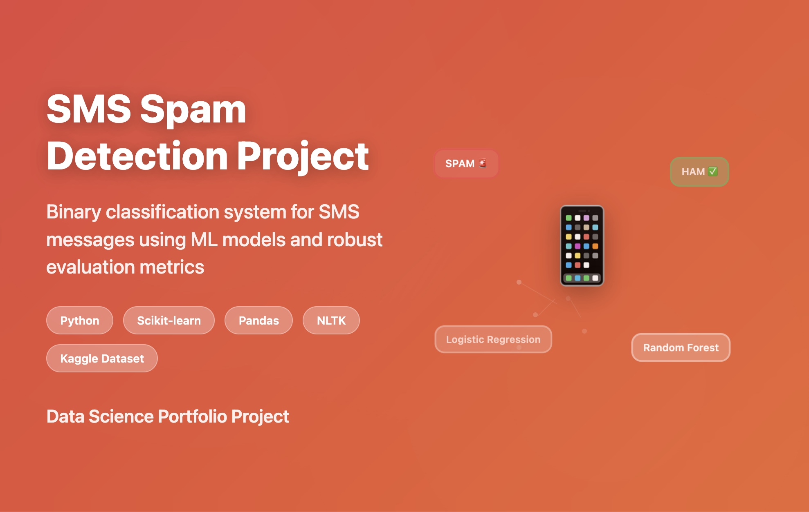

# SMS Spam Detection Project

Part of my data science portfolio - Building a machine learning system for binary classification of SMS messages.

## Project Overview
Developing a spam detection system using ML techniques, currently focusing on establishing strong baseline models and evaluation metrics.

### Motivation
This project builds on prior work in text analysis (e.g., [Word Cloud Visualization](https://nayeonkwonds.medium.com/deep-dive-into-word-cloud-creation-c2fc7fc09c12), [Travel Blog Analysis](https://nayeonkwonds.medium.com/web-scraping-and-text-analysis-of-travel-trends-on-blogs-e83a453d34ed)) and classification (e.g., [SME Closure Prediction](https://github.com/KwonNayeon/numble)). It establishes a solid foundation before diving into more sophisticated techniques, starting with strong baseline models and robust evaluation metrics to develop a deep understanding of the core challenges in classification.

## Tech Stack


**Data Processing & Analysis**
- **Pandas**: Data preprocessing and manipulation
- **NumPy**: Numerical computing for feature engineering

**Machine Learning & NLP**
- **Scikit-learn**: Classification algorithms and model evaluation
- **NLTK**: Text preprocessing and tokenization

**Data Visualization**
- **WordCloud**: Spam/ham text visualization
- **Matplotlib**: Model performance visualization
- **Seaborn**: Statistical analysis and confusion matrix plots

## Project Structure
```tree
/sms-spam-classifier
├── README.md                        # Project overview and documentation
├── LICENSE                          # Project license file
├── requirements.txt                 # Python dependencies
├── notebooks/                       # Jupyter notebooks for analysis
├── data/                            # Dataset
├── tests/                          # Unit tests
├── assets/                         # Images
└── docs/                           # Project documentation
```

## Current Progress
- Implemented initial baseline models using different approaches:
  - Count Vectorizer + Logistic Regression
  - TF-IDF + Random Forest
- Enhanced Exploratory Data Analysis (EDA) focusing on:
  - Message length distribution analysis
  - Text feature analysis (word count, special characters, capitals ratio, etc.)
  - Word frequency visualization and word clouds
- Basic text preprocessing and model evaluation completed

## Next Steps
1. Model Performance Improvement
2. Code Structure Enhancement
3. Further EDA and Feature Engineering

## Dataset
- Using the UCI SMS Spam Collection Dataset from Kaggle
- Binary classification: spam vs ham (non-spam) messages

---
*This project is part of my journey to become a data scientist who solves real-world problems through data-driven solutions.*
